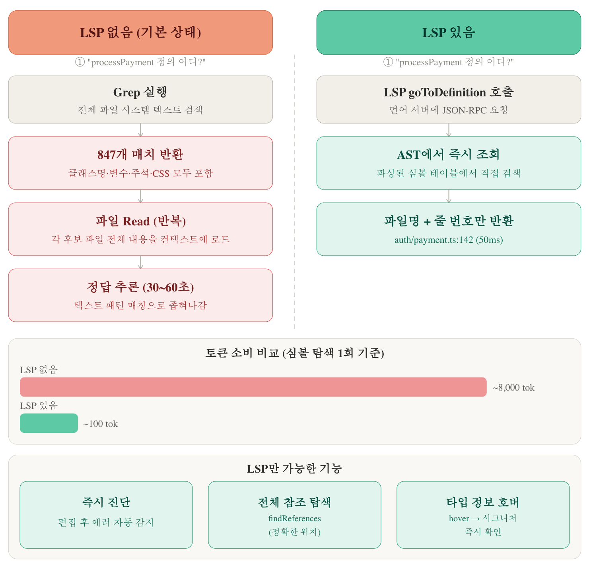

# Claude Code Expert LSP MCP 설명 

작성일: 2026-02-08
버전: 1.1
책의 분량상 LSP MCP의 자세한 설명과 활용법은 별도의 MD로 제공합니다. by CodeVillains


## LSP로 코드 인텔리전스 강화하기

Claude Code는 기본적으로 텍스트 검색(grep)으로 코드베이스를 탐색한다. 소규모 프로젝트에서는 충분하지만, 파일이 많아지면 검색 속도가 느려지고 주석이나 문자열 안의 동일한 텍스트까지 섞여 들어와 정확도가 떨어진다. 이때 LSP(Language Server Protocol)를 연결하면 Claude Code에 IDE 수준의 코드 네비게이션 능력을 부여할 수 있다.

#### LSP란 무엇인가

LSP(Language Server Protocol)는 편집기(클라이언트)와 언어 서버 사이의 JSON-RPC 기반 통신 규약이다. 마이크로소프트 공식 정의에 따르면, "편집기 또는 IDE와, 자동 완성·정의 이동·모든 참조 찾기 같은 언어 기능을 제공하는 언어 서버 사이에 사용되는 프로토콜"이다. 2016년 마이크로소프트가 Red Hat, Codenvy와 협력하여 오픈 표준으로 공개했으며, 현재 최신 안정 버전은 3.17이다.

중요한 것은 LSP 자체가 코드를 분석하는 것이 아니라는 점이다. 코드의 구문 트리와 타입 시스템을 분석하는 것은 각 언어의 언어 서버(TypeScript의 `vtsls`, Python의 `pyright`, Rust의 `rust-analyzer` 등)이고, LSP는 그 분석 결과를 편집기에 전달하는 통신 표준이다. 

LSP 등장 이전에는 10개 편집기 × 20개 언어 = 200개 연동을 각각 만들어야 했다. LSP 덕분에 편집기와 언어 서버 모두 프로토콜만 구현하면 되므로 10 + 20 = 30개로 전부 호환된다. VS Code에서 함수 위에 마우스를 올렸을 때 타입 정보가 뜨거나, "정의로 이동"이 동작하거나, 빨간 밑줄로 에러를 표시해주는 기능이 모두 LSP를 통해 언어 서버와 통신한 결과다.

#### LSP 유무에 따른 토큰 소비 비교



LSP 없이 텍스트 검색(Grep)으로 심볼을 탐색하면 클래스명, 변수, 주석, CSS까지 모두 매치되어 수천 토큰이 소모된다. LSP를 사용하면 언어 서버의 AST에서 정확한 위치만 반환하므로 토큰 소비가 대폭 줄어든다.

#### 이런 상황에서 효과적이다

- **리팩토링** — `findReferences`로 실제 참조만 정확하게 파악하여 누락 없이 수정할 수 있다
- **대규모 코드베이스** — 정의 찾기가 밀리초 단위로 빨라진다
- **코드 수정 직후 검증** — `getDiagnostics`로 빌드 없이 타입 에러를 즉시 확인할 수 있다
- **컨텍스트 절약** — grep은 100개 파일에서 2,000+ 토큰을 소모할 수 있지만, LSP는 정확한 결과만 반환하므로 약 500 토큰 수준으로 줄어든다

반대로, 파일 20개 미만의 소규모 프로젝트이거나 단순 파일 생성/설정 변경 작업이 대부분이라면 LSP 없이도 충분하다.

#### 설정 방법

Claude Code에 LSP를 연결하는 방법은 크게 두 가지 계열로 나뉜다. Claude Code 빌트인 플러그인 시스템을 사용하는 방법과, 외부 MCP 서버를 통해 연결하는 방법이다.

**방법 1: Claude Code 공식 LSP 플러그인 (권장)**

Claude Code는 v2.0.74(2025년 12월)에서 빌트인 LSP 도구를 추가했다. 이 방식은 MCP 서버가 아니라 Claude Code의 플러그인 시스템으로 동작한다. Claude Code 내부의 LSP 클라이언트가 직접 언어 서버를 시작하고 통신하므로, 중간에 MCP 서버를 거치는 오버헤드가 없고 파일 수정 후 에러를 자동 감지하는 기능도 지원된다. 그래서 `claude mcp add`가 아니라 `/plugin install`로 설치한다.

다만 v2.0.69~v2.0.x 사이에 레이스 컨디션 버그가 있었으므로, 안정적으로 사용하려면 v2.1.0 이상을 권장한다.

```bash
# 1. 언어 서버 바이너리 설치 (전제조건 — 플러그인이 통신할 언어 서버가 $PATH에 있어야 한다)
npm install -g @vtsls/language-server typescript

# 2. Claude Code 안에서 플러그인 마켓플레이스 등록 후 설치
/plugin marketplace add Piebald-AI/claude-code-lsps
/plugin install vtsls@claude-code-lsps
```

> **주의**: `npm install -g`는 언어 서버 바이너리를 시스템에 설치하는 **전제조건**이다. 이것만으로는 Claude Code와 연결되지 않으며, 반드시 `/plugin install`까지 완료해야 LSP 기능이 동작한다.

설치만 하면 별도 설정 없이 바로 동작한다. `goToDefinition`, `findReferences`, `documentSymbol`, `hover`, `getDiagnostics` 등 9개 오퍼레이션을 제공하며, 커뮤니티 마켓플레이스를 통해 TypeScript, Python, Go, Rust, Java, C/C++ 등 20개 이상의 언어를 지원한다.

**방법 2: MCP 서버 방식 (cclsp, Serena 등)**

공식 플러그인 대신 외부 MCP 서버로 LSP를 연결할 수도 있다. 이 경우 `claude mcp add`로 설정한다. 공식 플러그인이 지원하지 않는 언어를 쓰거나, 심볼 단위 편집 같은 고급 기능이 필요할 때 선택한다.

**cclsp** — 가벼운 LSP 브릿지. 대화형 위저드를 제공한다.

```bash
# 대화형 설치 (권장) — 프롬프트에서 언어를 선택하면 프로젝트의 .claude/ 하위에 cclsp.json을 생성한다
npx cclsp@latest setup

# 또는 수동 설정 — MCP 서버로 등록
claude mcp add cclsp -- npx cclsp@latest
```

`npx cclsp@latest setup`으로 설치하면 대화형 프롬프트에서 사용할 언어를 선택할 수 있으며, 프로젝트의 `.claude/cclsp.json`에 설정 파일이 생성된다. `claude mcp add`로 설치한 경우에는 사용자 MCP 설정(`~/.claude/mcp.json`)에 현재 프로젝트 기준으로 cclsp MCP 서버가 등록된다.

cclsp.json 설정 예시 (TypeScript/JavaScript 기준):

```json
{
  "servers": [
    {
      "extensions": ["js", "ts", "jsx", "tsx"],
      "command": ["npx", "--", "typescript-language-server", "--stdio"],
      "rootDir": "."
    }
  ]
}
```

> 언어별 설정 샘플은 [cclsp GitHub 리포지토리](https://github.com/nicobailey/cclsp)에서 확인할 수 있다.

**Serena** — LSP 기반이지만 심볼 단위 편집, 세션 메모리, 프로젝트 온보딩까지 포함하는 종합 코딩 에이전트 툴킷이다. 30개 이상의 언어를 지원하며, JetBrains IDE 플러그인과도 연동된다. Claude Code에서 사용할 때는 빌트인 LSP와 도구가 중복되므로 `--context claude-code` 옵션을 반드시 지정해야 한다.

```bash
claude mcp add serena -- uvx --from git+https://github.com/oraios/serena \
  serena start-mcp-server --context claude-code --project "$(pwd)"
```

#### 공식 플러그인 vs MCP 서버 방식 vs Serena

| 구분 | 공식 LSP 플러그인 | cclsp (MCP) | Serena (MCP) |
|------|-----------------|-------------|-------------|
| 설치 방식 | `/plugin install` | `claude mcp add` | `claude mcp add` |
| 기능 범위 | LSP 9개 오퍼레이션 + 자동 진단 | LSP 기능 (정의, 참조, 진단, 리네임) | LSP + 심볼 편집 + 메모리 + 온보딩 |
| 도구 수 | 빌트인 (고정 비용 없음) | 5~10개 | 20개 이상 |
| 고정 토큰 비용 | 최소 | 낮음 | 높음 (도구 설명이 많음) |
| 작업당 토큰 | 보통 | 보통 | 낮음 (심볼 단위 조작) |
| 설정 난이도 | 낮음 | 낮음 | 보통 (Python, uv 필요) |
| 적합한 상황 | 대부분의 프로젝트 | 공식 미지원 언어, 다중 언어 | 대규모 프로젝트, 종합 에이전트 필요 시 |

Tika 프로젝트처럼 TypeScript 단일 언어 기반이라면 공식 플러그인으로 충분하다. 토큰 비용도 가장 낮고 설정도 간편하다. 프로젝트가 커져서 심볼 단위 편집이나 세션 메모리가 필요해지면 그때 Serena를 검토하면 된다.

#### 사용 예시

LSP가 연결된 상태에서 Claude Code에게 다음과 같이 요청하면, 텍스트 검색 대신 언어 서버의 분석 결과를 자동으로 활용한다.

```
TicketStatus 타입이 사용된 모든 위치를 찾아줘.
```

```
> Using findReferences for symbol "TicketStatus"
Found 12 references:
  - src/shared/types/index.ts:8:1 (declaration)
  - src/shared/validations/ticket.ts:15:22
  - src/server/services/ticketService.ts:3:10
  - src/client/components/Column.tsx:5:10
  ... (8 more)
```

텍스트 검색이었다면 주석이나 문자열 속 "TicketStatus"까지 포함되었을 것이다. 언어 서버는 실제 코드 참조만 반환하므로 이 결과를 기반으로 안전하게 리팩토링을 진행할 수 있다.

수정 직후 타입 에러 확인도 간단하다.

```
방금 수정한 route.ts에 에러 없는지 확인해줘.
```

```
> Using getDiagnostics for app/api/tickets/route.ts
  - Error at line 45: Type 'string' is not assignable to type 'TicketPriority'
```

`npm run build`를 돌리기 전에 문제를 잡을 수 있으므로 수정→검증 사이클이 빨라진다.
